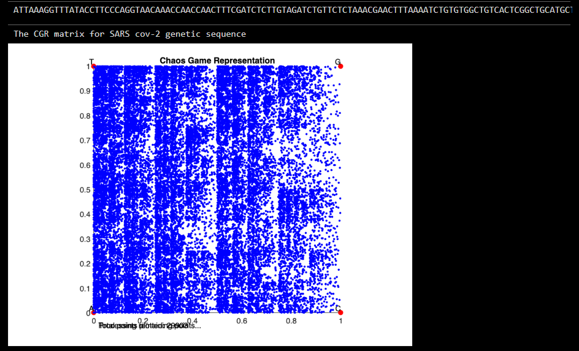
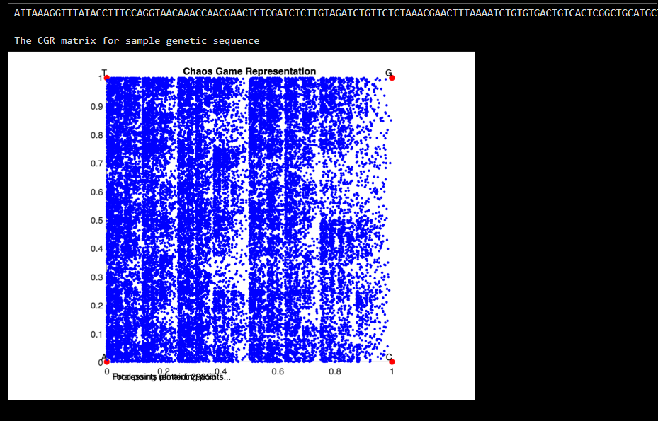
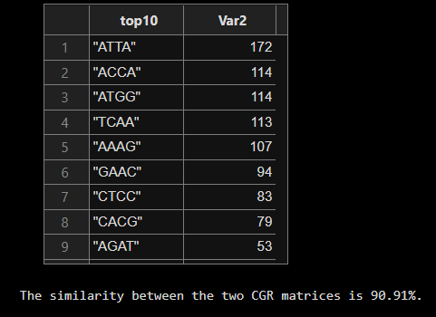
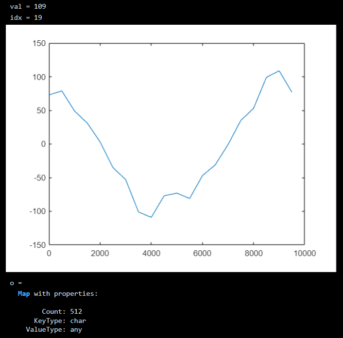
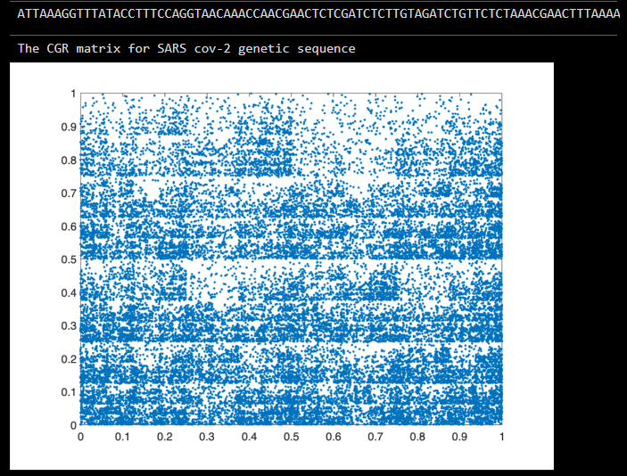
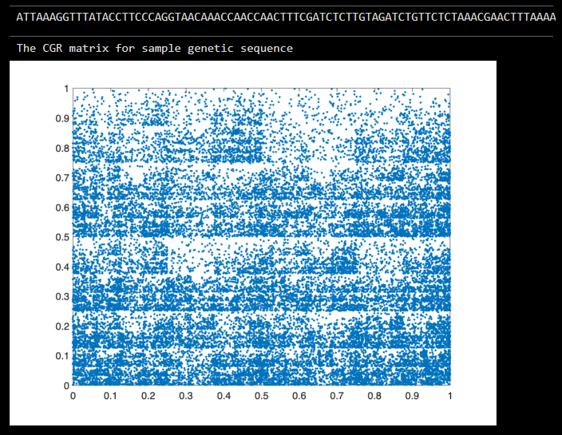

# 🧬 Comparative Genomic Analysis using Chaos Game Representation (CGR)

### **MATLAB Implementation for DNA Sequence Visualization, GC-Skew, and Similarity Analysis**

[](https://www.mathworks.com/products/matlab.html)
[](https://opensource.org/licenses/MIT)
[]()
[]()

---

## 📘 Project Overview

This MATLAB project presents a **computational analysis and visualization** of genomic sequences using the **Chaos Game Representation (CGR)** technique and associated bioinformatics methods.  
It explores **pattern recognition, k-mer frequency, GC skew, and sequence similarity** between **SARS-CoV-2** and related genomes (e.g., **RatG13**).

CGR provides a **fractal-like graphical representation** of DNA sequences, revealing patterns that correspond to genomic composition and structure. This project aims to visualize such relationships and quantify genetic similarity through matrix correlation.

---

## 🧩 Features

- 🔹 **Chaos Game Representation (CGR)** visualization for nucleotide sequences  
- 🔹 **GC Skew** computation for analyzing base pair distribution  
- 🔹 **K-mer frequency and clump analysis** for detecting repeating motifs  
- 🔹 **Comparative visualization** between two genomes  
- 🔹 **Similarity measurement** between CGR matrices  
- 🔹 **Interactive hybrid CGR animation**

---

## 🧠 Concepts Used

| Concept | Description |
|----------|--------------|
| **CGR (Chaos Game Representation)** | A fractal-based method to represent DNA sequences in 2D space. |
| **K-mer Analysis** | Counts occurrences of every substring of length *k* to find local patterns. |
| **GC Skew** | Measures the imbalance between Guanine (G) and Cytosine (C) nucleotides across the genome. |
| **Clump Finding** | Identifies regions where specific k-mers appear repeatedly within a fixed window. |
| **CGR Matrix Correlation** | Quantifies similarity between two genomes based on matrix correlation. |

---

## 🧪 Implemented MATLAB Scripts

| File | Description |
|------|--------------|
| **code1.m** | Generates the Chaos Game Representation (CGR) for SARS-CoV-2 and performs GC Skew & k-mer analysis. |
| **code2.m** | Performs detailed k-mer clump analysis and GC skew plotting for the RatG13 genome. |
| **code3.m** | Implements animated hybrid CGR visualization for any given genetic sequence. |
| **code4.m** | Compares CGR matrices of two genomes (e.g., SARS-CoV-2 vs. RatG13) and computes their similarity percentage. |

---

## 📊 Sample Visualizations

### 🔹 Chaos Game Representation (CGR)
Visualizes the fractal pattern formed by nucleotide positions.





### 🔹 K-mer Frequency Analysis
Top 10 most frequent k-mers identified within a genome.

   

### 🔹 GC Skew Plot
Analyzes GC bias across genomic regions to identify replication origins and terminus points.



### 🔹 CGR Matrix Similarity
A visual and quantitative comparison between two genomes.

   

---

## ⚙️ How to Run

### **1️⃣ Requirements**
- MATLAB R2022a or newer  
- Bioinformatics Toolbox (`fastaread` function)

### **2️⃣ Input Data**
Provide genome sequences in **FASTA format (.txt/.fasta)**, for example:
- `beta_covid.txt` — SARS-CoV-2 genome  
- `ratg13.txt` — RatG13 bat coronavirus genome  

### **3️⃣ Execution**
```matlab
% Run any script in MATLAB command window
>> code1
>> code2
>> code3
>> code4
